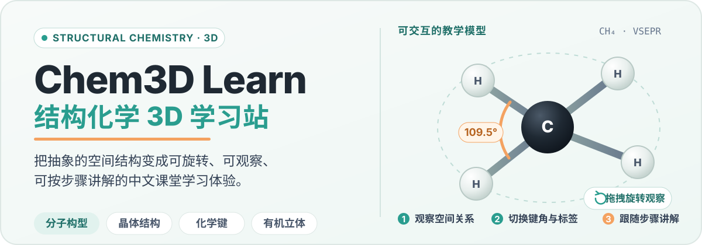
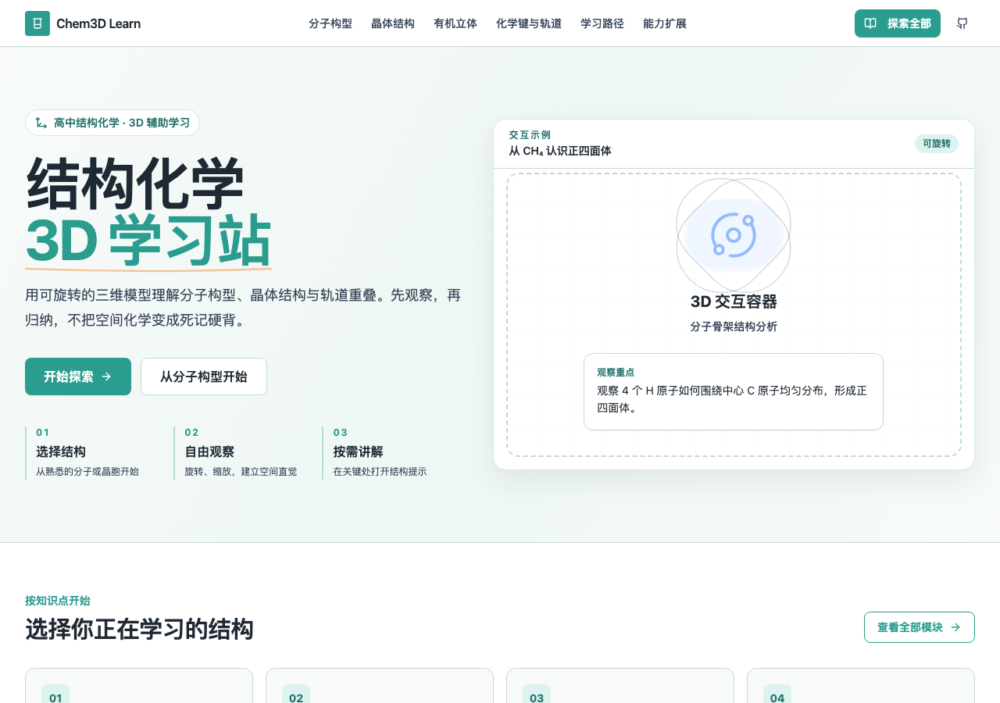
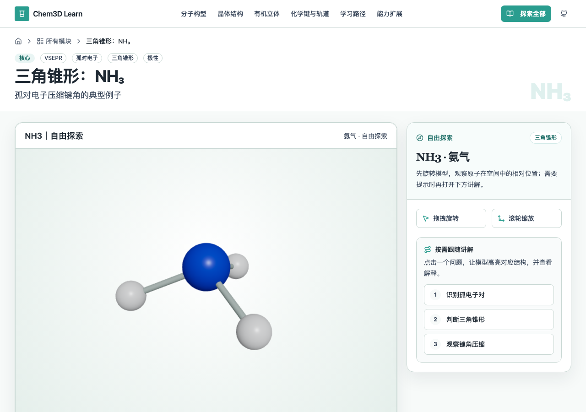
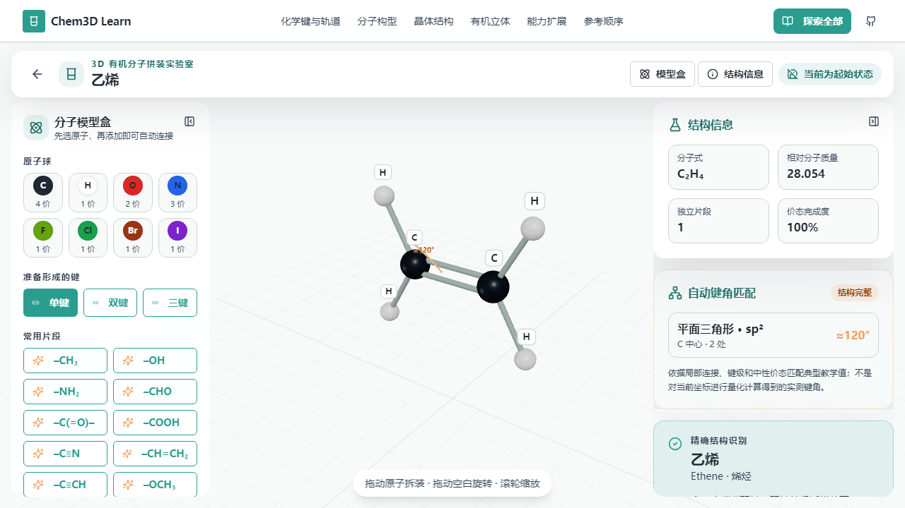
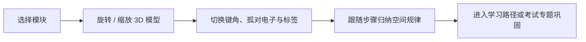
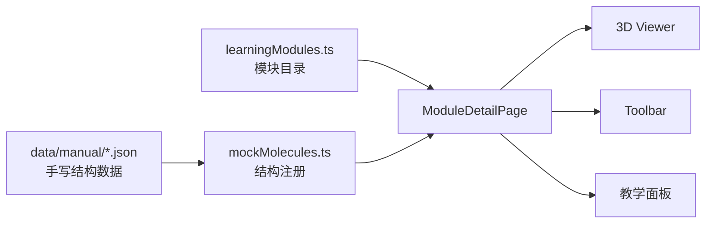

<p align="center">
  
</p>

<p align="center">
  
  
  
  
  
</p>

<p align="center">
  <a href="#真实界面">真实界面</a> ·
  <a href="#核心能力">核心能力</a> ·
  <a href="#快速开始">快速开始</a> ·
  <a href="#项目结构">项目结构</a> ·
  <a href="#验证与测试">验证与测试</a>
</p>

Chem3D Learn（结构化学 3D 学习站）是一个面向中国高中生和化学教师的中文结构化学学习网站。它用可旋转的三维模型、简洁的步骤讲解和课堂友好的控制，把分子构型、晶体结构、化学键与有机立体结构从平面图变成可以直接观察的空间关系。

当前产品以前端实现为准；不需要启动后端，也能完整浏览主要学习体验。

## 真实界面

<p align="center">
  
</p>

<p align="center">
  
  
</p>

界面采用浅色、清晰、适合课堂投影的教育风格。3D 学习页优先保证模型画布尺寸，再用工具栏和讲解面板承接键角、孤对电子、标签与步骤提示。

## 核心能力

- **分子空间构型**：围绕 CH₄、NH₃、H₂O、CO₂、BF₃ 等典型结构学习 VSEPR、键角、孤对电子与分子极性。
- **晶体结构观察**：覆盖 NaCl、CsCl、CaF₂、BaTiO₃、金属密堆积、ZnS、石墨、MOF-5、MXene、PBA 等教学模型，可分场景观察晶胞、配位、空隙和计数。
- **化学键与轨道**：通过 σ 键、π 键、杂化轨道与电子云示意理解成键方向和空间重叠。
- **有机立体结构**：观察乙烯、乙炔、苯与综合共面模型，并在 3D 拼装实验室中拖拽原子或常用片段。
- **按步骤学习**：模块目录、推荐路径、考试专题和精简中文讲解适合自学，也适合教师投屏演示。
- **范围内实时反馈**：有机拼装可显示分子式、相对分子质量、价态完整度、典型键角、官能团与已支持结构的名称；超出当前教学命名范围时会明确拒绝猜测。

## 学习方式



## 快速开始

环境要求：Node.js `>=20`，以及随 Node.js 安装的 npm。

```bash
git clone https://github.com/A7m0spHere/chem3D-learn.git
cd chem3D-learn/frontend
npm install
npm run dev
```

浏览器打开 `http://localhost:5173`。前端是主产品，日常学习和界面开发不需要启动 `backend/`。

生产构建与本地预览：

```bash
cd frontend
npm run build
npm run preview
```

> 项目使用 `createBrowserRouter`。部署到静态托管平台时，需要配置 SPA history fallback；仓库目前尚未绑定正式部署平台。

## 技术栈

| 层次 | 技术 |
| --- | --- |
| 前端基础 | Vite 6、React 18、TypeScript 5（strict） |
| 界面 | Tailwind CSS、shadcn/ui、Lucide |
| 3D | React Three Fiber、Drei、Three.js |
| 路由与加载 | React Router、路由级懒加载、按学习意图预取 3D 资源 |
| 测试 | Playwright logic / production / visual suites |
| 可选后端 | 原生 `node:http`、只读 GET API、零运行时依赖 |
| 演示视频 | 独立 Remotion 4 子项目 |

结构数据以 `frontend/src/data/manual/` 中的手写 JSON 为真源，经模块目录和 viewer registry 分发到对应的 3D 画布、工具栏与教学面板：



## 项目结构

```text
chem3D-learn/
├─ frontend/              # 主产品：Vite + React + TypeScript + R3F
│  ├─ src/pages/          # Home / Modules / Paths / Exam / About 等页面
│  ├─ src/components/     # 通用 UI、教学面板与 3D viewer
│  ├─ src/data/manual/    # 手写分子 / 晶体结构数据
│  └─ tests/              # logic 与浏览器行为 / 视觉测试
├─ backend/               # 可选的极简只读 API
├─ video/                 # 独立的 65 秒 Remotion 演示视频项目
├─ docs/                  # 产品、设计、数据、QA 与协作治理文档
└─ AGENTS.md              # 项目开发约束与验证流程
```

`frontend/` 使用 React 18，`video/` 使用 React 19；它们拥有独立的 `package-lock.json` 和依赖树，请分别安装依赖，不要混用。

## 验证与测试

前端常用命令：

```bash
cd frontend
npm run build
npm run lint
npm run test:logic
npm run test:production
```

后端测试：

```bash
cd backend
npm test
```

- `npm run build` 会先执行 TypeScript 类型检查，再生成 Vite 生产构建。
- `npm run test:logic` 运行不依赖浏览器截图的逻辑回归。
- `npm run test:production` 用真实生产预览验证首页不会提前下载重型 3D 资源。
- 视觉快照当前以 macOS 基线为准；在 Windows 或 Linux 上不要直接更新这些快照。

## 内容与产品边界

这个项目强调高中课堂中的空间直觉，不追求成为完整化学数据库。当前不会引入登录、用户账户、付费、教师后台、动态 SMILES、RDKit 运行时、数据库或 AI 聊天功能。

分子和晶体模型以教学表达为目的；NaCl 等内容可能使用简化模型。遇到尚未核实的化学事实，项目会保留 `TODO-CHEM-VERIFY`，而不是补写未经确认的数据。

## 参与项目

开始修改前，建议先阅读：

- [`docs/PROJECT_BRIEF.md`](./docs/PROJECT_BRIEF.md)：产品定位与范围
- [`docs/DESIGN_SYSTEM.md`](./docs/DESIGN_SYSTEM.md)：视觉方向与设计 token
- [`docs/MOLECULE_DATA_SCHEMA.md`](./docs/MOLECULE_DATA_SCHEMA.md)：手写结构数据规范
- [`docs/PROJECT_STATUS.md`](./docs/PROJECT_STATUS.md)：当前进度、验证结果与已知限制
- [`AGENTS.md`](./AGENTS.md)：仓库协作、验证与交付规则

如果你发现教学事实、交互或浏览器兼容问题，可以[提交 Issue](https://github.com/A7m0spHere/chem3D-learn/issues)并附上模块路径、浏览器信息和复现步骤。

## 许可证

当前仓库尚未包含 `LICENSE` 文件。使用、修改或分发代码前，请先联系仓库维护者确认授权范围。
